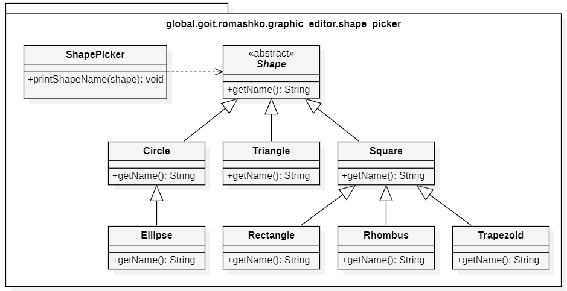

# Graphic editor

## Task:

Ти створюєш графічний редактор.

Продумай ієрархію класів. Мають бути як мінімум:

* базовий клас для фігури `Shape`. Цей клас має мати метод для виведення назви фігури.
* класи, що унаслідуються від `Shape` - `Circle`, `Quad` і т.д. - не менше п'яти варіантів.
* має бути клас, що приймає фігуру, та виводить її назву. Клас має працювати саме з базовим класом `Shape`.

Зверни увагу на використання засобів ООП - інтерфейсів, абстрактних класів, модифікаторів доступу.

Немає єдиного правильного шляху вирішення цієї задачі. Намагайсь спроектувати гнучку архітектуру, задаючи собі запитання виду "А що буде, якщо цей клас потрібно буде змінювати? Що ще зміниться, якщо тут потрібно буде розширити можливості?"

## Solution

As a solution for the task, a graphic editor have been taken as an example of domain. Usually graphic editor has some sort of toolbox and drawing area (e.g. MS Paint, GIMP, app.diagrams.net, etc.). Toolbox has different available shapes to pick and add them to the drawing area.

As a simplification we will use simple plane polygon shapes.

